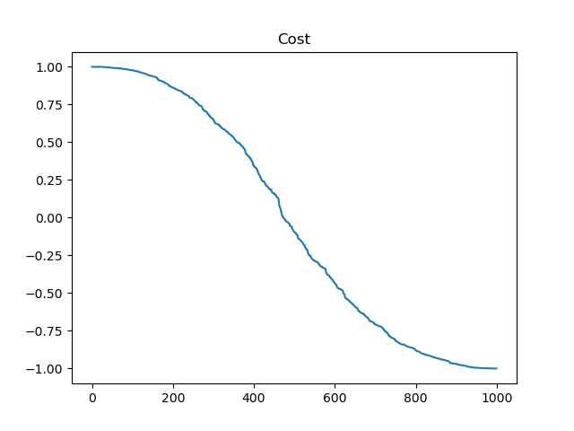

# One Qubit

Initial: 

$$ H_0 = \sigma_x = {\left\lbrack \matrix{0 & 1 \cr 1 & 0} \right\rbrack}
, | \phi_0 \rangle = {1 \over \sqrt{2}} {\left\lbrack \matrix{1 \cr 1} \right\rbrack}
$$

Final: 

$$ H_1 = \sigma_z = {\left\lbrack \matrix{1 & 0 \cr 0 & -1} \right\rbrack}
, | \phi_1 \rangle = {\left\lbrack \matrix{0 \cr 1} \right\rbrack}
$$

Cost:

$$ \langle \phi_0 | U^\dagger H_1 U | \phi_0 \rangle
$$

```
s0: [[0.70711 0.70711]]
H0 * s0: [[0.70711 0.70711]]
U1 * s0: [[-0.00003  1.     ]]
H1 * U1 * s0: [[-0.00003 -1.     ]]
cost: -0.9999999979274405
```


