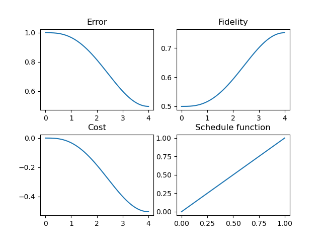
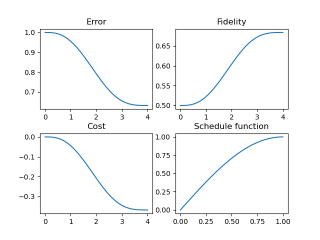
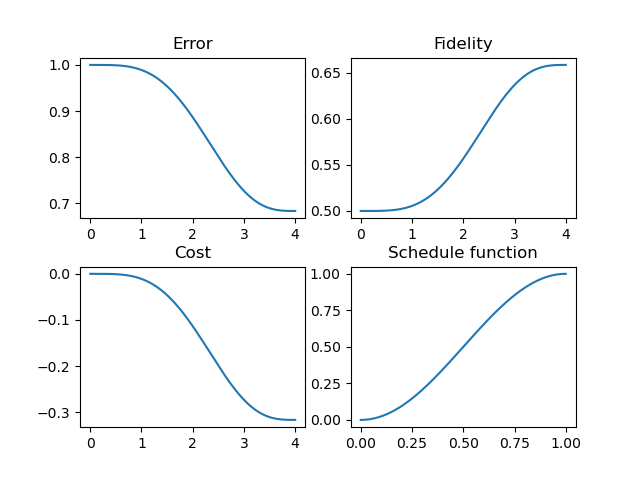
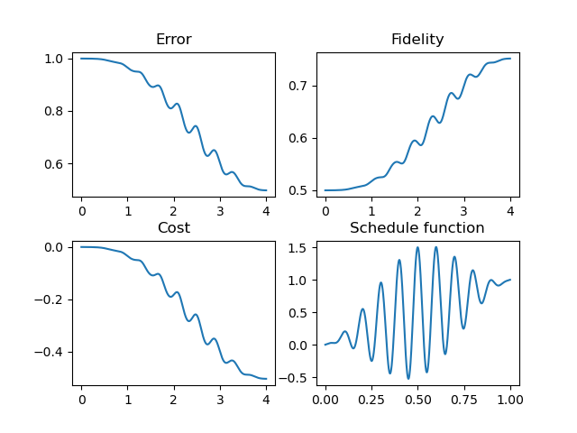

# One Qubit

## Simulated time evolution

### 2-param piece-wise cubic interpolation

$p =(0.2, 0.2)$


$p = (0.8, 0.2)$


There are [more](../../output/one_qubit/2params/)

### Line

$$
\lambda(t) = t
$$



### Sin

$$
\lambda(t) = \sin(\pi / 2 t)
$$



### Sin^2

$$
\lambda(t) = \sin^2(\pi / 2 t)
$$



### Something wild

$$
\lambda(t) = t + \sin^2(\pi t) \cos(20 \pi t)
$$




## Random time evolution

Initial: 

$$ H_0 = \sigma_x = {\left\lbrack \matrix{0 & 1 \cr 1 & 0} \right\rbrack}
, | \phi_0 \rangle = {1 \over \sqrt{2}} {\left\lbrack \matrix{1 \cr 1} \right\rbrack}
$$

Final: 

$$ H_1 = \sigma_z = {\left\lbrack \matrix{1 & 0 \cr 0 & -1} \right\rbrack}
, | \phi_1 \rangle = {\left\lbrack \matrix{0 \cr 1} \right\rbrack}
$$

Cost:

$$ \langle \phi_0 | U^\dagger H_1 U | \phi_0 \rangle
$$

```
s0: [[0.70711 0.70711]]
H0 * s0: [[0.70711 0.70711]]
U1 * s0: [[-0.00003  1.     ]]
H1 * U1 * s0: [[-0.00003 -1.     ]]
cost: -0.9999999979274405
```


