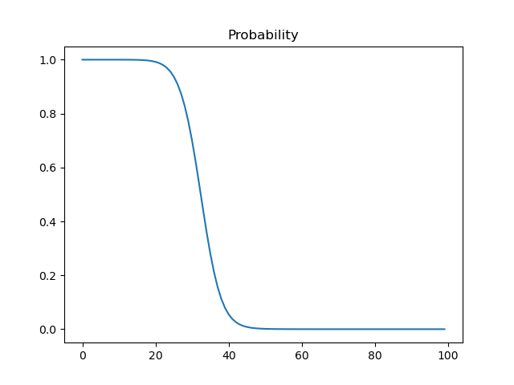

# QuTiP Sandbox

## Time-dependent Hamiltonian

$$
H = H_0 - f(t) H_1
$$

$$
f(t) = A exp \lbrack - \lparen {t \over \sigma} \rparen ^2 \rbrack
$$

### Reference

[Solving Problems with Time-dependent Hamiltonians](https://qutip.org/docs/latest/guide/dynamics/dynamics-time.html#function-based-time-dependence)
